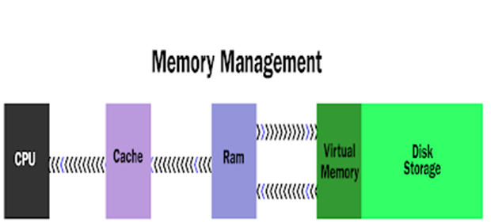

아래는 메모리 관리와 가상 메모리에 대한 내용을 마크다운 언어로 정리한 것입니다:

---

# 메모리 관리

메모리 관리는 컴퓨터 시스템에서 메모리 자원을 효율적으로 배분하고 사용하는 기술을 의미합니다. 운영 체제(OS)와 하드웨어는 메모리 관리 기능을 통해 애플리케이션과 시스템 프로세스가 메모리를 효과적으로 활용할 수 있도록 지원합니다. 메모리 관리는 프로그램의 실행, 메모리의 할당 및 해제, 가상 메모리 관리, 메모리 보호 등을 포함합니다.

## 메모리 관리의 주요 요소

### 메모리 할당 (Memory Allocation)

- **정적 할당 (Static Allocation)**: 프로그램이 컴파일될 때 메모리가 할당되며, 실행 중에는 변경되지 않습니다.
- **동적 할당 (Dynamic Allocation)**: 프로그램 실행 중에 필요에 따라 메모리를 할당하고 해제합니다. 일반적으로 `malloc()`, `free()`와 같은 함수로 구현됩니다.

### 메모리 해제 (Memory Deallocation)

- **설명**: 사용이 끝난 메모리를 반환하여 재사용할 수 있도록 합니다.
- **중요성**: 메모리 누수를 방지하고, 시스템의 메모리 자원을 효율적으로 관리합니다.

### 가상 메모리 (Virtual Memory)

- **설명**: 물리적 메모리(RAM)와 디스크 저장소를 결합하여 더 큰 메모리 공간을 제공합니다. 각 프로세스는 자신만의 독립적인 가상 주소 공간을 가집니다.
- **기술**:
    - **페이지닝 (Paging)**: 메모리를 페이지 단위로 나누어 관리하며, 필요할 때 디스크에서 페이지를 메모리로 로드합니다.
    - **세그멘테이션 (Segmentation)**: 논리적 단위로 메모리를 나누어 각 세그먼트를 독립적으로 관리합니다.

### 메모리 보호 (Memory Protection)

- **설명**: 프로세스가 자신에게 할당된 메모리만 접근하도록 제한하여 시스템의 안정성과 보안을 강화합니다.
- **기술**: 각 프로세스의 메모리 공간을 분리하고, 접근 권한을 설정하여 불법적인 메모리 접근을 방지합니다.

### 메모리 스와핑 (Swapping)

- **설명**: 메모리에서 디스크로 프로세스의 일부를 이동시켜 메모리 자원을 확보합니다. 디스크에 저장된 데이터를 다시 메모리로 로드하여 프로세스를 계속 실행합니다.
- **장점**: 메모리 자원의 사용 효율성을 높이고, 동시에 실행할 수 있는 프로세스 수를 증가시킵니다.

## 가상 메모리

가상 메모리는 보조 메모리(하드 드라이브나 SSD 등)를 주 메모리(RAM)처럼 사용할 수 있는 메모리 운영 방식입니다. 이는 컴퓨터 운영 체제에서 흔히 사용되는 기술입니다.

### 가상 메모리의 필요성

- **다중 프로그래밍과 시간 분할**: 컴퓨터가 여러 프로그램을 동시에 처리할 수 있도록 지원하며, 프로그램이 가상 주소를 사용합니다.
- **주소 매핑**: 가상 메모리는 프로그램의 주소를 RAM 주소로 매핑합니다. 이 매핑 과정은 두 단계로 나뉩니다: 첫 번째 단계는 컴파일러가 수행하고, 두 번째 단계는 운영 체제가 수행합니다.

## 가상 메모리 작동 방식
### 가상 메모리와 캐시 메모리

- **캐시 메모리**: CPU와 주 메모리(RAM) 사이에 위치하는 고속의 메모리로, 데이터 접근 속도를 높이기 위해 자주 사용되는 데이터나 명령어를 저장합니다.
- **주소 매핑**: CPU가 메모리 접근을 시도할 때, 먼저 캐시 메모리에서 가상 주소를 검색합니다.
- **캐시 히트와 캐시 미스**:
    - **캐시 히트**: 필요한 데이터가 캐시에 존재할 때, CPU는 이를 캐시에서 직접 읽어옵니다.
    - **캐시 미스**: 필요한 데이터가 캐시에 존재하지 않을 때, CPU는 주 메모리(RAM)에서 데이터를 읽어와야 합니다.
- **디스크와 메모리 간의 상호작용**: 캐시는 가상 메모리의 직접적인 구성 요소는 아니지만, 가상 메모리와 함께 작동하여 전체 시스템 성능을 향상시킵니다.

### 페이지 파일 (또는 스와프 파일)

- **정의**: 디스크에 저장되는 특별한 파일로, 물리적 메모리(RAM)가 부족할 때 데이터를 저장하는 데 사용됩니다.
- **작업 원리**: RAM에 있는 데이터 중 사용하지 않는 부분이 페이지 파일로 이동되어 RAM을 확보합니다. 필요한 경우, 페이지 파일에서 RAM으로 다시 로드됩니다.

### 페이지 교체 (Page Replacement)

- **페이지 교체**: RAM이 가득 차면 운영 체제는 페이지 교체 알고리즘을 사용하여 어떤 데이터를 디스크로 옮길지 결정합니다.
- **페이지 교체 알고리즘**:
    - **FIFO (First-In-First-Out)**: 가장 오래된 페이지를 교체합니다.
    - **Optimal (OPT)**: 미래에 가장 오랫동안 사용되지 않을 페이지를 교체합니다.
    - **LRU (Least Recently Used)**: 가장 최근에 사용되지 않은 페이지를 교체합니다.

### 스레싱 (Thrashing)

- **정의**: 메모리가 부족하여 페이지 교체가 너무 빈번하게 발생할 때 발생하는 성능 저하 상태입니다.
- **발생 원인**:
    - 메모리 부족: 시스템에 물리적 메모리(RAM)가 부족하고, 프로그램이 필요한 메모리 양이 과도할 때 발생합니다.
    - 페이지 폴트 증가: 프로그램이 메모리에서 자주 접근해야 하는 페이지가 디스크에 위치하고 있어, 매번 페이지를 디스크에서 메모리로 읽어야 하는 상황입니다.
    - 과도한 페이지 교체: 시스템이 메모리를 충분히 할당받지 못하여 디스크와 메모리 간의 페이지 교체가 매우 빈번해지면 성능 저하가 발생합니다.
  
### 가상 메모리의 장점

- **메모리 공간 문제 해결**: 가상 메모리를 사용하면 프로그램이 여러 주소를 공유할 수 있어 메모리 공간 문제를 해결합니다.
- **데이터 보안**: 가상 메모리는 각 프로그램이 다른 가상 주소를 사용하게 하여 서로의 데이터를 접근하지 못하도록 보안성을 제공합니다.
- **메모리 단편화 및 오류 방지**: 가상 메모리는 각 프로그램에 고유한 주소 공간을 제공하여 메모리 단편화를 방지하고 디버깅을 용이하게 합니다.

### 가상 메모리의 단점

- **속도 저하**: 가상 메모리를 사용할 때 시스템 속도가 느려질 수 있습니다.
- **시간 지연**: 작업 간 전환에 시간이 더 걸립니다.
- **하드 드라이브 공간 소모**: 하드 드라이브 공간을 많이 사용합니다.
- **시스템 안정성 감소**: 시스템 안정성을 저하시킬 수 있습니다.

가상 메모리는 큰 주 메모리처럼 보이는 저장 매체를 제공하여 물리적 메모리가 부족할 때도 큰 프로그램을 실행할 수 있게 해줍니다. 가상 메모리는 RAM이 부족할 때 하드 드라이브의 일부를 메모리처럼 사용하여 시스템의 성능을 향상시킬 수 있지만, RAM에 비해 느리기 때문에 성능에 영향을 줄 수 있습니다.

---
