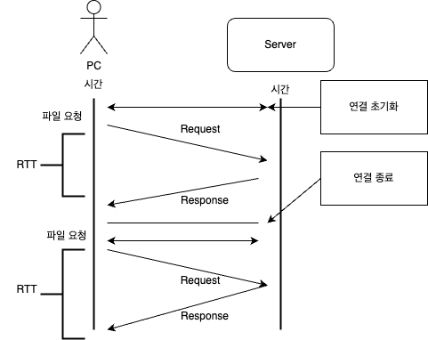
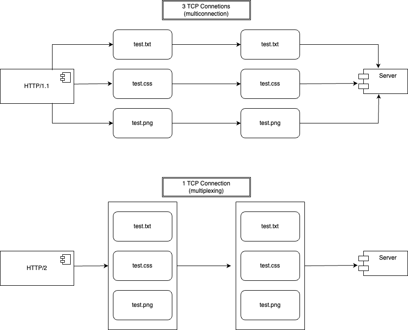
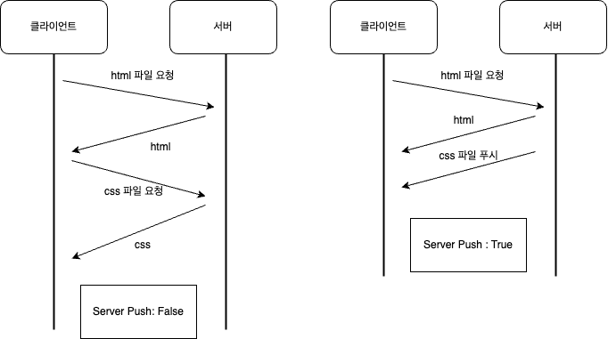
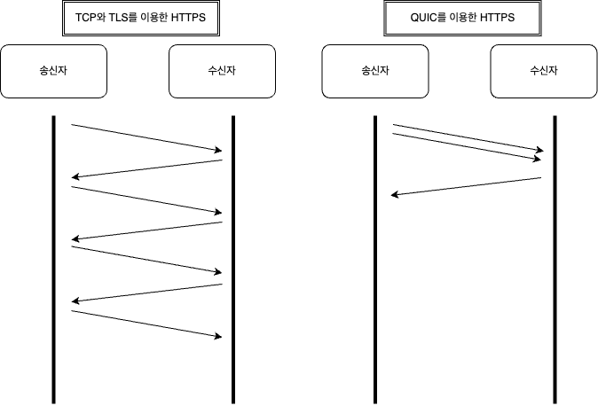

# HTTP/1.0부터 HTTP/3까지: 주요 특징 및 동작 방식

## HTTP/1.0
HTTP/1.0은 Hypertext Transfer Protocol의 첫 번째 버전 중 하나로, 웹 브라우저와 웹 서버 간의 통신을 정의하는 프로토콜입니다. 1996년에 공식적으로 발표되었으며, 오늘날의 웹 통신 기초를 형성합니다.

### 주요 특징 및 동작 방식
- **단일 연결, 단일 요청/응답(Single Request-Response per Connection)**
    - HTTP/1.0은 기본적으로 하나의 TCP 연결에서 하나의 요청과 응답을 처리한 후 연결을 닫습니다. 즉, 클라이언트가 웹 서버에 요청을 보내면, 서버는 응답을 보내고 나서 연결을 종료합니다.

### 제한점
- **연결의 비효율성**: 각 요청마다 새로운 연결을 설정하고 해제해야 하므로, 여러 리소스 요청 시 비효율적입니다.
- **지속 연결(Persistent Connection)의 부재**: HTTP/1.0은 지속적인 연결을 유지하는 기능을 기본적으로 제공하지 않으며, 서버로부터 파일을 가져올 때마다 TCP의 3-웨이 핸드셰이크를 계속해서 열어야 하기 때문에 RTT가 증가하는 단점이 있습니다.
  

## HTTP/1.1
HTTP/1.1은 1997년에 표준화된 버전으로, HTTP/1.0에 비해 여러 가지 중요한 개선사항을 포함하고 있습니다.

### 주요 개선사항
- **지속 연결 (Persistent Connections)**
    - HTTP/1.1에서는 기본적으로 TCP 연결을 유지합니다. 여러 요청과 응답이 동일한 TCP 연결을 통해 이루어지므로, 연결을 재설정하는 데 드는 오버헤드가 줄어들고 성능이 향상됩니다.

- **파이프라이닝 (Pipelining)**
    - HTTP/1.1에서는 클라이언트가 서버로 다수의 요청을 동시에 보내는 것이 가능해졌습니다. 클라이언트는 첫 번째 요청에 대한 응답을 기다리지 않고 연속적으로 여러 요청을 보낼 수 있습니다.
      

### 문제점
- **HOL Blocking**: 문서 안에 포함된 다수의 리소스를 처리할 때, 요청할 리소스 개수에 비례해서 대기 시간이 길어지는 단점이 있습니다.

## HTTP/2
HTTP/2는 HTTP/1.1의 한계를 극복하고 웹 성능을 개선하기 위해 2015년에 표준화된 차세대 웹 전송 프로토콜입니다.

### 주요 특징
- **이진 프로토콜 (Binary Protocol)**: HTTP/2는 텍스트가 아닌 이진 형식으로 데이터를 전송합니다.
- **멀티플렉싱 (Multiplexing)**: 단일 TCP 연결에서 여러 요청과 응답을 동시에 처리할 수 있는 기능을 지원합니다.
 

- **헤더 압축 (Header Compression)**: HPACK이라는 압축 방식을 사용해 전송되는 데이터 양을 줄이고 성능을 향상시킵니다.
- **서버 푸시 (Server Push)**: 클라이언트가 요청하지 않은 리소스를 서버가 미리 클라이언트로 전송할 수 있는 기능을 제공합니다.
 

## HTTPS
HTTPS는 HTTP Secure의 약자로, 웹에서 데이터를 안전하게 전송하기 위한 HTTP의 확장 버전입니다. HTTPS는 HTTP와 TLS (Transport Layer Security) 또는 SSL (Secure Sockets Layer)을 결합하여 데이터를 암호화하고 보안을 강화합니다.

### HTTPS의 작동 원리
1. **암호화**
    - 전송 암호화: 클라이언트와 서버 간의 데이터 전송을 암호화하여 제3자가 내용을 읽거나 변조할 수 없게 만듭니다.
2. **인증**
    - 서버 인증: HTTPS는 웹 서버의 신뢰성을 검증하는 인증서를 사용합니다.
3. **HTTPS 연결 과정 (핸드셰이크)**
    - 세션 키 생성: 클라이언트와 서버는 세션 키를 생성하고, 이 키를 사용해 암호화된 데이터를 주고받습니다.

### HTTPS 구축 방법
1. **CA에서 인증서 구매 후 설치**
2. **로드밸런서를 통한 HTTPS 제공**
3. **CDN을 통한 HTTPS 구축**

## HTTP/3
HTTP/3는 TCP 대신 QUIC을 사용하는 최신 HTTP 프로토콜입니다. QUIC은 Google에서 개발한 전송 프로토콜로, UDP 기반이지만 TCP와 비슷한 연결 안정성을 제공하며, 빠른 연결 설정과 더 나은 전송 효율성을 목표로 합니다.

### 주요 특징
- **빠른 연결 설정**: QUIC은 TLS 암호화를 포함하는 단일 연결 설정 과정을 통해 연결 설정 속도가 빠릅니다.
 

- **헤드 오브 라인 블로킹 문제 해결**: HTTP/3는 QUIC을 통해 패킷 손실이 발생해도 다른 스트림의 패킷 전송에 영향을 주지 않기 때문에 전송 효율성이 더 높습니다.
- **향상된 보안**: HTTP/3는 TLS 1.3을 기본으로 사용하여 강력한 암호화를 제공합니다.
- **모바일 및 무선 네트워크에 최적화**: HTTP/3는 네트워크 변동이 있는 상황에서도 안정적으로 연결을 유지할 수 있습니다.

