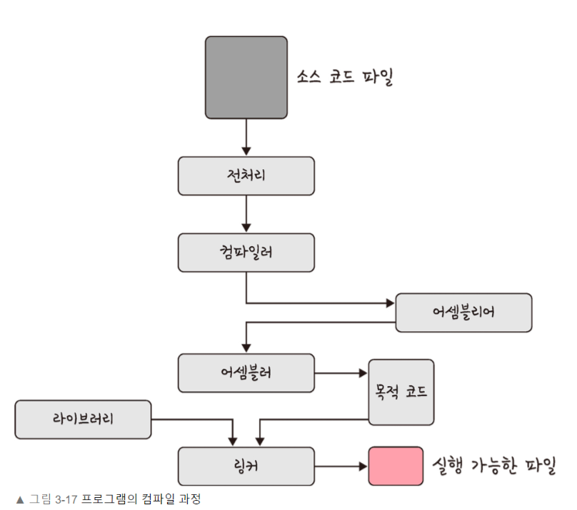

# 프로세스와 스레드

프로세스: 컴퓨터에서 실행되고 있느 프로그램을 말하여 CPU스케줄링의 대상이 되는 작업(tesk)아라는 용어와 거의 같은 의미  
 
스레드: 프로세스 내 작업의 흐름

 

프로그램이 실행하는 과정: 프로그램이 메모리에 올라가면 프로세스가 되는 인스턴스화가 일어나고, 이후 운영체제의 CPU 스케줄러에 따라 CPU가 프로세스를 실행합니다.

## 프로세스와 컴파일 과정

프로세스는 프로그램이 메모리에 올라가 인스턴스화 된 것을 말합니다. 여기서 프로그램은 아직 실행되지 않은 코드들의 모음을 말합니다. 예를 들어 프로그램은 구글 크롬 프로그램(chrome.exe)과 같은 실행 파일이며, 이를 두 번 클릭하면 구글 크롬 프로세스로 변환되는 것입니다.

 

 

### 전처리

소스 코드의 주석을 제거하고 #include 등 헤더 파일을 병합하여 매크로를 치환합니다.

### 컴파일러

오류 처리, 코드 최적화 작업을 하며 어셈블리어로 변환합니다.

### 어셈블러

어셈블리어는 목적코드로 변환됩니다. 확장자는 운영체제마다 다릅니다.

### 링커

프로그램 내에 있는 라이브러리 함수 또는 다른 파일들과 목적 코드를 결합하여 실행 파일을 만듭니다.

 

#### 정적 라이브러리와 동적 라이브러리

정적 라이브러리

-   프로그램 빌드 시 라이브러리가 제공하는 모든 코드를 실행 파일에 넣는 방식
-   시스템 환경 등 외부 의존도가 낮은 장점이 있지만 코드 중복 등 메모리 효율성이 떨어지는 단점이 있음

동적 라이브러리

-   프로그램 실행 시 필요할 때만 DLL이라는 함수 정보를 통해 참조하여 라이브러리를 쓰는 방법
-   메모리 효율성에서의 장점을 지니지만 외부 의존도가 높아진다는 단점이 있음

 

## 프로세스의 상태

 

### 생성 상태

생성 상태는 프로세스가 생성된 상태를 의미하여 fork() 또는 exec() 함수를 통해 생성합니다. 이때 PCB(Process Control Block)가 할당됩니다.

-   fork(): 부모 프로세스의 주소 공간을 그대로 복사하며, 새로운 자식 프로세스를 생성하는 함수입니다. 주소 공간만 복사할 뿐이지 부모 프로세스의 비동기 작업 등을 상속하지는 않습니다.
-   exec():새롭게 프로세스를 생성하는 함수입니다.

### 대기 상태

대기 상태는 메모리 공간이 충분하면 메모리를 할당받고 아니면 아닌 상태로 대기하고 있으며 CPU 스케줄러로부터 CPU 소유권이 넘어오기를 기다리는 상태입니다.

### 대기 중단 상태

대기 중단 상태는 메모리 부족으로 일시 중단된 상태입니다.

### 실행 상태

실행 상태는 CPU 소유권과 메모리를 할당받고 인스트럭션을 수행 중인 상태를 의미합니다.

### 중단 상태

중단 상태는 어떤 이벤트가 발생한 이후 기다리며 프로세스가 차단된 상태입니다. I/O 디바이스에 의한 인터럽트로 이런 현상이 많이 발생합니다.

> CPU는 매우 빠르기 때문에 I/O를 기다리면 자원 손실이 많습니다. (프린트 인쇄하는데 많은 시간이 소요) 인터럽트가 발생하면 프로세스를 중단 상태로 두고 다른 프로세스를 처리합니다. 그리고 인터럽트가 종료되면 다시 이 프로세스를 처리합니다.

### 일시 중단 상태

일시 중단 상태는 대기 중단과 유사합니다. 중단된 상태에서 프로세스가 실행되려고 했지만 메모리 부족으로 일시 중단된 상태입니다.

### 종료 상태

종료 상태는 메모리와 CPU 소유권을 모두 놓고 가는 상태를 말합니다. 종료는 자연스럽게 종료되는 것도 있지만 부모 프로세스가 자식 프로세스를 강제시키는 바지발적 종료로 종료되는 것도 있습니다. 자식 프로세스에 할당된 자원의 한계치를 넘어서거나 부모 프로세스가 종료되거나 사용자자 process.kill 등 여러 명령어로 프로세스를 종료할 때 발생합니다.
